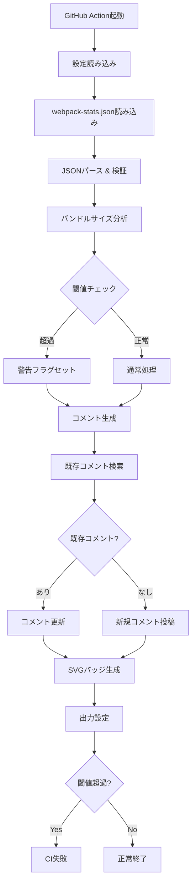

# Bundle Stats Action アーキテクチャ設計書

## 1. 概要

Bundle Stats
Actionは、webpack-stats.jsonを解析してPRにバンドルサイズ情報をコメントするGitHub
Actionです。本ドキュメントでは、アクションの全体的なアーキテクチャと実装方針について説明します。

## 2. アーキテクチャ方針

### 2.1 基本方針

- **モジュラーアーキテクチャ**: 各機能を独立したモジュールとして実装
- **単一責任の原則**: 各モジュールは1つの明確な責任を持つ
- **テスタビリティ**: 依存性注入を活用し、モック可能な設計
- **エラーハンドリング**: 明確なエラー境界と適切なフォールバック

### 2.2 技術選定理由

- **TypeScript**: 型安全性による実行時エラーの削減
- **Jest**: ESMサポートとTypeScript統合の実績
- **`@actions/core` & `@actions/github`**: GitHub公式SDK

## 3. モジュール構成

```plain
src/
├── index.ts              # エントリポイント
├── main.ts               # メイン処理のオーケストレーション
├── config/
│   └── types.ts          # 設定関連の型定義
├── parser/
│   ├── stats-parser.ts   # webpack-stats.json解析
│   └── types.ts          # webpack stats関連の型定義
├── analyzer/
│   ├── bundle-analyzer.ts # バンドルサイズ分析と閾値チェック
│   └── types.ts          # 分析結果の型定義
├── formatter/
│   ├── comment-formatter.ts # PRコメント生成
│   ├── badge-generator.ts   # SVGバッジ生成
│   └── types.ts            # フォーマット関連の型定義
├── github/
│   ├── comment-manager.ts  # PRコメント管理（投稿・更新）
│   └── types.ts           # GitHub API関連の型定義
└── utils/
    ├── file-size.ts       # ファイルサイズ計算・フォーマット
    └── logger.ts          # ロギングユーティリティ
```

## 4. データフロー



## 5. 各モジュールの詳細設計

### 5.1 Stats Parser モジュール

**責務**: webpack-stats.jsonの読み込みと解析

```typescript
interface WebpackStats {
  assets: Asset[]
  chunks?: Chunk[]
  modules?: Module[]
}

interface Asset {
  name: string
  size: number
  chunks: string[]
  emitted: boolean
  isOverSizeLimit?: boolean
}
```

**主要機能**:

- JSONファイルの読み込み
- スキーマ検証
- assets配列の抽出
- initial/bundle判定ロジック

### 5.2 Bundle Analyzer モジュール

**責務**: バンドルサイズの分析と閾値判定

```typescript
interface AnalysisResult {
  assets: AnalyzedAsset[]
  totalSize: number
  exceededFiles: string[]
  totalExceeded: boolean
}

interface AnalyzedAsset {
  name: string
  size: number
  sizeText: string
  exceeded: boolean
}
```

**主要機能**:

- 個別ファイルサイズチェック
- 合計サイズ計算
- 閾値超過判定
- サイズの人間可読形式変換

### 5.3 Comment Formatter モジュール

**責務**: PRコメントのMarkdown生成

**主要機能**:

- Markdownテーブル生成
- 折りたたみ表示（details/summary）
- 処理中表示の対応
- コメントサイズ制限対応（上位N件表示）
- HTML識別子の埋め込み

### 5.4 Badge Generator モジュール

**責務**: SVGバッジの生成

```typescript
interface BadgeOptions {
  label: string
  message: string
  color: 'success' | 'warning' | 'error'
}
```

**主要機能**:

- SVGテンプレート生成
- 動的な幅計算
- ステータスに応じた色分け

### 5.5 Comment Manager モジュール

**責務**: GitHub APIを使用したPRコメント管理

**主要機能**:

- 既存コメントの検索（HTML識別子使用）
- 新規コメント投稿
- 既存コメント更新
- APIエラーハンドリング
- レート制限対策

## 6. エラーハンドリング戦略

### 6.1 エラーレベル

1. **Fatal**: アクション自体を失敗させる（core.setFailed）

   - webpack-stats.jsonが存在しない
   - JSONパースエラー
   - 必須の環境変数不足

2. **Warning**: 警告ログを出力して処理継続

   - 一部のアセット情報が不完全
   - コメントサイズ制限による省略

3. **Info**: 情報ログのみ
   - キャッシュヒット
   - 既存コメントの更新

### 6.2 フォールバック処理

- コメント投稿失敗時: ログ出力のみでアクション自体は成功
- SVGバッジ生成失敗時: バッジなしで処理継続

## 7. パフォーマンス考慮事項

### 7.1 メモリ使用量

- 大きなwebpack-stats.jsonファイル対応
  - ストリーミング処理は不要（通常数MB以内）
  - 必要な情報のみメモリに保持

### 7.2 API呼び出し最適化

- 既存コメント検索は1回のみ
- バッチ処理は不要（単一PR対応）

## 8. セキュリティ考慮事項

### 8.1 入力検証

- ファイルパスのサニタイゼーション
- JSONスキーマ検証
- サイズ値の範囲チェック

### 8.2 出力エスケープ

- Markdownインジェクション対策
- ファイル名のエスケープ

## 9. テスト戦略

### 9.1 単体テスト

各モジュールを独立してテスト:

- Parser: 様々なwebpack-stats.json形式
- Analyzer: 境界値テスト
- Formatter: Markdown出力検証
- Manager: APIモック使用

### 9.2 統合テスト

- エンドツーエンドのデータフロー
- エラーケースのシミュレーション
- GitHub APIモックを使用した全体フロー

### 9.3 テストデータ

`__fixtures__/`に各種テストケース:

- 正常なwebpack-stats.json
- 巨大なファイル
- 不正な形式
- エッジケース

## 10. 拡張性への配慮

### 10.1 将来的な拡張ポイント

- 他のバンドラー対応（Rollup, esbuild等）
- 差分表示機能
- カスタムフォーマッター
- Webhookサポート

### 10.2 インターフェース設計

- プラグイン可能なアーキテクチャ
- 設定による挙動のカスタマイズ
- 出力フォーマットの拡張

## 11. デプロイとリリース

### 11.1 ビルドプロセス

1. TypeScriptコンパイル
2. Rollupによるバンドル
3. dist/index.jsの生成
4. action.ymlとの統合

### 11.2 バージョニング

- セマンティックバージョニング
- メジャータグ（v1, v2）の自動更新
- CHANGELOGの維持

## 12. まとめ

このアーキテクチャは、保守性、テスタビリティ、拡張性を重視した設計となっています。各モジュールが明確な責任を持ち、疎結合に設計されているため、個別の改善や新機能の追加が容易です。

中小規模プロジェクト向けという要件に対し、シンプルさを保ちながら必要十分な機能を提供する設計を目指しています。
